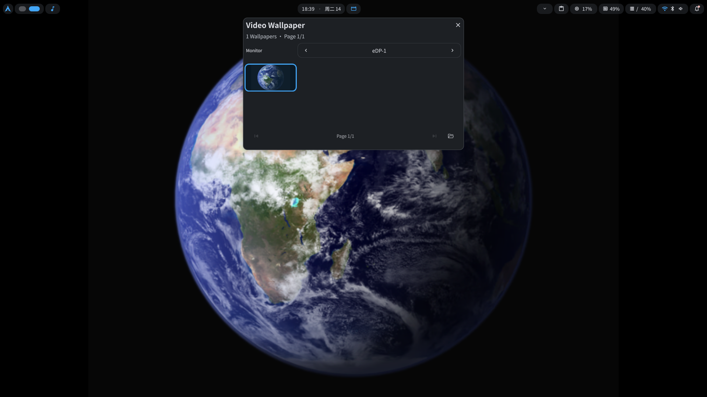

# MpvPaper Plugin

This is a composite desktop video wallpaper plugin built for DMS, based on mpvpaper. It includes both the wallpaper daemon and a DankBar widget.

## Core Features
* Multi-monitor support: Independent video playlists can be set for different screens.
* GPU hardware acceleration: Built-in support for multiple hardware decoding modes such as nvdec, vaapi, and vdpau, significantly reducing CPU usage.
* Memory leak protection: Supports customizable scheduled auto-restarts for the playback process to ensure the system remains smooth over long periods of operation.
* Idle resource recovery: The plugin hooks into the DMS lock screen state. When the system is locked, the plugin automatically stops rendering to save power.
* DankBar widget: Browse and switch video wallpapers directly from the status bar.

## System Dependencies
**Required**: This plugin requires `mpvpaper` and `ffmpeg` (`ffmpeg` generates video thumbnails).
* Arch Linux: `sudo pacman -S ffmpeg`
* Arch Linux (AUR): `yay -S mpvpaper`

## Usage
After installation, go directly to "System Settings -> MpvPaper Plugin" to manage the video library, adjust volume, and set the tiling mode.

## DankBar Widget
After enabling the plugin, add **MpvPaper Plugin** to your DankBar layout to switch wallpapers without opening the settings page.

## License
MIT
